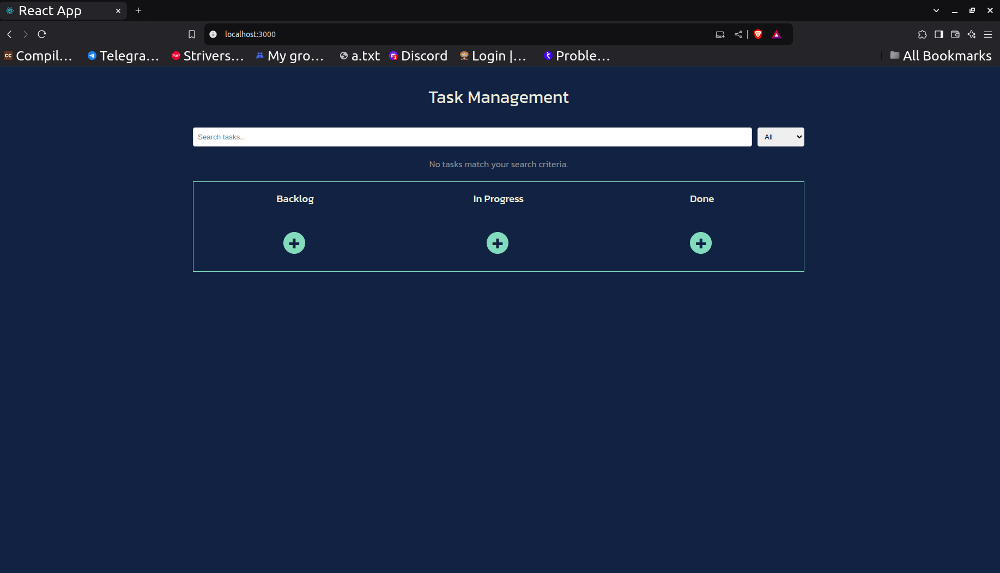
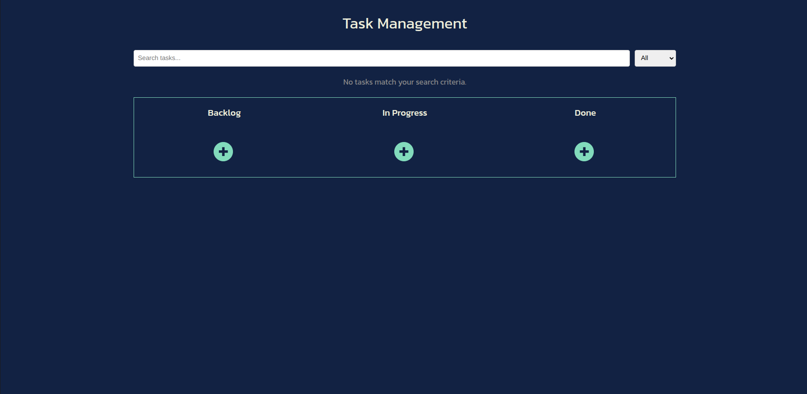
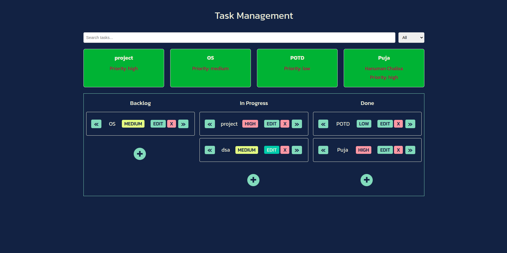
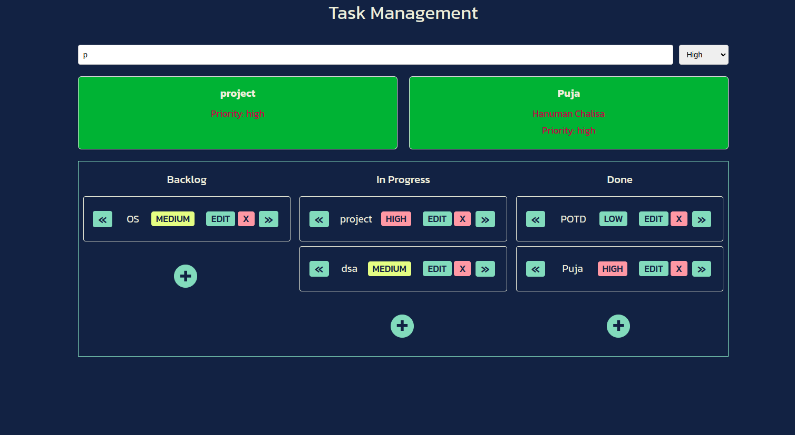

<div align="centre"  max-width="fit-content" margin-left= "auto"  margin-right= "auto">
  
  # TaskManager  
</div>

## [Questions.md](./questions.md) 
File contains QnA to Technical Questions

## Table of Contents
<details>
  <summary>Expand</summary>
  <ol>

- [TaskManager  ](#taskmanager--)
  - [Question.md](#questionmd)
  - [Table of Contents](#table-of-contents)
  - [Images](#images)
  - [Features](#features)
      - [Documentation](#documentation)
      - [Request Feature](#request-feature)
  - [TechStack](#techstack)
  - [Requirements](#requirements)
  - [Installation](#installation)
    - [Setup NodeJS](#setup-nodejs)
    - [Setup Project](#setup-project)
  - [Maintainers 👨‍💻](#maintainers-)
  - [Licence 🍁](#licence-)
    - [**MIT**  © Tanya Gupta](#mit---tanya-gupta)
  - [Contributing 💙](#contributing-)
  - [💖 Like this project ?](#-like-this-project-)

</ol>
</details>

## Images
<div align="centre">


<!--  -->


</div>

## Features


<!--  -->


#### [Documentation](https://github.com/TanyaGupta0621/TaskManager/blob/main/README.md)
#### [Request Feature](https://github.com/TanyaGupta0621/TaskManager/issues)


##  TechStack 
👾
<details>
  <ul>
    <a href = "https://reactjs.org/">
    React.js </a>
  </ul>
  <ul>
    CSS, HTML
  </ul>
  <ul>
    
  [Google Fonts](https://fonts.google.com/)
  </ul>
</details>


## Requirements
[TaskManager](https://github.com/TanyaGupta0621/TaskManager) is a NodeJS application based.

For codebase use the package manager [npm](https://www.npmjs.com/) to install [TaskManager](https://github.com/TanyaGupta0621/TaskManager).

<br>

## Installation
### Setup NodeJS
- [Guide](https://nodejs.org/en/learn/getting-started/how-to-install-nodejs)
- [Windows](https://www.geeksforgeeks.org/installation-of-node-js-on-windows/)
- [Mac](https://nodesource.com/blog/installing-nodejs-tutorial-mac-os-x/)
- [Linux](https://www.geeksforgeeks.org/installation-of-node-js-on-linux/)

### Setup Project 
```
git clone https://github.com/TanyaGupta0621/TaskManager.git
cd TaskManager
npm install
npm run start
```


## Maintainers 👨‍💻
  <div>
      <p align="center">
<a href="https://github.com/TanyaGupta0621/TaskManager/graphs/contributors">
  
</a></p>
  </div>

- ### [Tanya Gupta](https://github.com/TanyaGupta0621)   [](https://www.linkedin.com/in/tanya0621/)


## Licence 🍁
### [**MIT**](/LICENSE)  &copy; [Tanya Gupta](https://github.com/TanyaGupta0621)

## Contributing 💙

PR's are welcome !Found a Bug ? 

Create an [Issue](https://github.com/TanyaGupta0621/TaskManager/issues).

## 💖 Like this project ?

Leave a ⭐ If you think this project is cool.
 <p align="center"></p>
